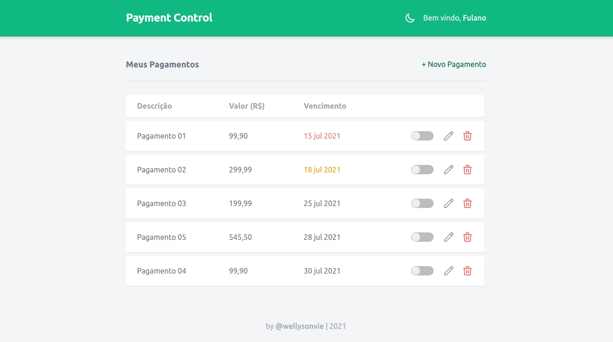

# Payment Control

Web app para organização e controle de pagamentos.

Acessar a demonstração: https://payment-control.vercel.app

<!-- <p align="center">
  
</p> -->

## ✨ Tecnologias

- [TypeScript](https://www.typescriptlang.org/)
- [ReactJS](https://reactjs.org/)
- [Tailwind CSS](https://tailwindcss.com/)

## 🚀 Como executar

Clone o projeto e acesse a pasta do mesmo.

```bash
$ git clone https://github.com/wellysonvie/payment-control.git
$ cd payment-control
```

Para iniciá-lo, siga os passos abaixo:

```bash
# Instalar as dependências
$ yarn

# Iniciar o projeto
$ yarn start
```

Agora você pode acessar [`http://localhost:3000`](http://localhost:3000) no navegador.
